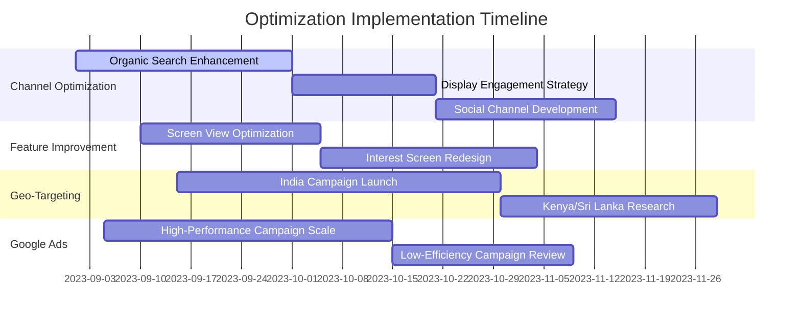

# Data Analysis for Optimizing User Engagement: App & Website Installations

 <!-- Replace with actual project banner image -->

## Overview
This comprehensive data analysis project identifies key opportunities to optimize user engagement and conversion rates for app and website installations. The analysis covers multiple dimensions including channel performance, user behavior, demographic patterns, and marketing campaign effectiveness.

## Key Areas of Analysis

### 1. Channel Entry Analysis
- **Conversion Rates**: Organic Search leads with 56.62% conversion rate
- **Engagement Time**: Direct Search has highest average engagement time (40.78%)
- **User Acquisition**: Display attracts highest new users (100k) but low engagement

**Recommendations**:
- Allocate more resources to Organic Search optimization
- Improve engagement strategies for Display channels
- Increase engagement in Organic Social channels

### 2. Event Analysis
- **Top Event**: "Screen View" has highest event count (695K)
- **Per User Engagement**: "Notification Dismiss" has highest count (95 events/user)
- **Conversions**: "Notification Receive" leads with 95k conversions

**Recommendations**:
- Leverage "Screen View" events for engagement optimization
- Enhance "My Interests Screen" interaction
- Analyze and fix "Another Event Name Not Set" tracking issues

### 3. Pages and Screens Analysis
- **Views per User**: Flutter leads with 18.0 views/user (14%)
- **Conversions**: "Not Set" category dominates with 98% of conversions
- **Low Performance**: 15 categories show zero conversions

**Recommendations**:
- Optimize Flutter content and features
- Investigate conversion barriers in low-performing categories
- Reallocate resources to high-performing areas

### 4. Geographic Analysis
- **Country Performance**: India leads with 192K conversions (99%)
- **City Performance**: Bengaluru dominates with 63K conversions
- **Opportunity Areas**: Kenya shows zero conversions; Sri Lanka has low conversion rate (0.33%)

**Recommendations**:
- Tailor marketing to Indian audience
- Investigate low conversion in Sri Lanka and Kenya
- Replicate Bengaluru's success in other cities

### 5. Demographic Analysis
- **Age Groups**: "Unknown" age leads conversions (99k); 18-24 group is second (66k)
- **Gender**: "Unknown" gender has highest conversions (93k)
- **Engagement Time**: Varies significantly by interest category

**Recommendations**:
- Implement prompts for age/gender information
- Develop targeted strategies for different age groups
- Monitor demographic trends continuously

### 6. User Interest Analysis
- **Top Category**: "Shoppers" leads with 87K conversions
- **Engagement Time**: "Shoppers/Shoppers by Store Type" has highest (3417)
- **Low Performance**: "Sports & Fitness" category has only 20 conversions

**Recommendations**:
- Target shopping-interested users
- Revise sports-related marketing strategies
- Analyze high-engagement categories for optimization insights

### 7. Google Ads Campaign Analysis
- **Cost Efficiency**: "Cost per Conversion App Installed for April" most efficient (18.4)
- **Click Performance**: "App Installed by Shaid" has highest clicks (147,100)
- **Conversion Leaders**: "Conversion by Campaign App Installed for May" leads with 12,257 conversions

**Recommendations**:
- Optimize high-efficiency campaigns like "Cost per Conversion App Installed for April"
- Reallocate budget to low-cost channels like "Video App Install with PS Install" (cost: 0.5)
- Analyze success factors of top-performing campaigns
- Revise strategies for underperforming campaigns like "App Installed by May 2022"

## Methodology
- **Data Sources**: Google Analytics, Google Ads, App Installation Tracking
- **Tools Used**: Python (Pandas, NumPy, Matplotlib), SQL, Google Data Studio
- **Analysis Techniques**: Conversion rate analysis, Cohort analysis, Funnel analysis, ROI calculation, User segmentation

## Key Metrics Tracked
| Metric | Description |
|--------|-------------|
| Conversion Rate | Percentage of users who complete desired action |
| Engagement Time | Average time users spend interacting |
| Cost per Conversion | Marketing cost divided by conversions |
| User Acquisition | Number of new users by channel |
| Event Count | User interactions with specific features |

## How to Use This Analysis
1. **Marketing Teams**: Optimize budget allocation based on channel performance
2. **Product Teams**: Prioritize feature development for high-engagement areas
3. **UX/UI Teams**: Improve interfaces for low-conversion screens
4. **Regional Teams**: Develop location-specific engagement strategies

## Recommendations Implementation Roadmap

## Next Steps
1. Prioritize recommendations based on potential impact and implementation complexity
2. Develop A/B testing plans for proposed changes
3. Establish KPIs for measuring optimization success
4. Schedule monthly performance review meetings
5. Implement continuous monitoring system for key metrics

## Contact
**Logambal J**  
[LinkedIn Profile](https://linkedin.com/in/sagarputhalapattu) | [Email](mailto:sagarputhalapattu@gmail.com)

> "Data-driven optimization is the key to unlocking sustainable user engagement growth."
